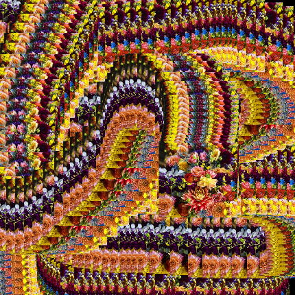

# Computational Photography 

Hello! These are the materials for the computational photography workshop taught by Adam Ferriss (aferriss@gmail.com) at the Anderson Ranch summer of 2020.

#### Table of Contents
- [Schedule](#schedule)
- [What is Computational Photograph](#what-is-computational-photography)
- [Workshop Format](#workshop-format)
- [What you'll get out of it](#what-youll-get-out-of-it)
- [Code of Conduct](#code-of-conduct)
- [Setting up your environment](#setting-up-your-coding-environment)
- [Code Examples](#code-examples)
- [Resources](#resources)

## Schedule

**\*The schedule may change depending on the pace and needs of the class!**

#### Meeting Times
July 27 - 31

*The below times are in MST*
9am - 11am Class time and demos 
11am - 1pm Lunch
1pm - 4pm Class time and individual meetings

#### Day 1 - Monday July 27  

- Introductions
- Workshop Overview
- Setting up your environment
- p5 image function demos
  - `loadImage()`
  - `image()`
  - `get()`
  - `set()`
  - `copy()`
- exporting your work

#### Day 2 - Tuesday July 28

- Pixel Part 1
  - looping over pixel array
  - accessing individual pixels
  - pixels as data

#### Day 3 - Wednesday July 29

- Pixels Part 2
  - Kernel Convolution demo
- Shaders Part 1
  - Shader Syntax
  - Texture2D
  - Shader functions `smoothstep()`, `step()`, `clamp()`, `mix()`

#### Day 4 - Thursday July 30 
- Shaders Part 2
  - UV fun (wiggle, distort, displacement)
  - Shader convolution
- Multipass rendering
  - Feedback

#### Day 5 - Friday July 31 

- Going further
- Work Share / Critique

## What is Computational Photography?

  

Computational Photography is actually a pretty broad term but for the purposes of this class, I am taking it to mean any method by which a photograph or digital image can be manipulated via code. 

In the broader definition, it refers to imaging techniques that expand the capability of digital cameras / sensors through the use of software. A lot of this tech was made for our phones. Think of portrait mode on iPhones or Google's night sight on Androids. Newer techniques using machine learning have also been deployed for things like upscaling small images, removing noise and artifacts, or extracting 3d depth information from single photographs. We'll look at some of these new advances in the course of this workshop.

## Workshop Format

We'll be meeting on zoom every morning from 9am - 11am for live coding demos of new techniques. We'll have a short break for lunch and then return in the afternoon at 1pm. Depending on the day, we will likely do a combination of individual meetings and demos in the afternoon, ending at 4pm.

On Friday we'll all get together to share our work and critique.

## What (I hope) you'll get out of it

My hope is that you take away some of the core techniques for learning how to manipulate images with code. Hopefully these are processes that will help further your own artistic practice and expand your tool set for artistic expression / ideation. What you produce here is up to you. If you want to make a suite of new tools for your own practice, great! If you want to just sit back and soak it in and experiment with the examples I provide, that's totally fine too! 

I'll be leaving this repo up as a resource for you and the general public for as long as I can so hopefully it is something you can return to for guidance or help for as long as you need it.

I'm here to help you as much as I can so please don't hesitate to reach out if you need help or even just wanna chat (e-mail is great but we can talk about setting up a slack or discord if people are interested). Also reach out to your fellow workshop-mates. We're only together for a short time but we can all learn from each other during this week.

Lastly, I encourage you to consider the ways in which computational photography (and code based image making in general) might cause harm in the world (ex. face recognition used for surveilance by an authoritarian govt). What can we use these technologies for that will move the needle in the direction of racial, social, and ecological justice?

## Code of Conduct

This code of conduct was borrowed from the p5.js code of conduct but the same tenets apply in this workshop.

* **Be mindful of your language.** Any of the following behavior is unacceptable: 
  * Offensive comments related to gender identity and expression, sexual orientation, race, ethnicity, language, neuro-type, size, ability, class, religion, culture, subculture, political opinion, age, skill level, occupation, or background
  * Threats of violence
  * Deliberate intimidation
  * Sexually explicit or violent material that is not contextualized and preceded by a considerate warning 
  * Unwelcome sexual attention
  * Stalking or following
  * Or any other kinds of harassment

  Use your best judgement. If it will possibly make others uncomfortable, do not post it.

* **Be respectful.** Disagreement is not an opportunity to attack someone elses thoughts or opinions. Although views may differ, remember to approach every situation with patience and care. 
* **Be considerate.** Think about how your contribution will affect others in the community. 
* **Be open minded.** Embrace new people and new ideas. Our community is continually evolving and we welcome positive change.

## Setting up your coding environment

If you're just learning to code, or just want to get started quickly, I strongly recommend that you use the p5.js code editor which can be found at [https://p5js.editor.com](https://p5js.editor.com). Be sure to make an account, otherwise you won't be able to save your sketches or upload images. You can always download your code and move it to another environment later if you don't like the online editor.

However, if you'd like to branch out and explore other options, I recommend you [download VSCode](https://code.visualstudio.com/). Along with VSCode you may want to download some [extensions](#environment-and-code-editor). I've listed a few of the ones I use below in the resource section, but of particular note is the VSCode live share extension. This may be useful so that we can code together during one on one sessions. The live server extension is also really handy for spinning up a localhost server (which you will need to use images) from within VSCode.

If you opt to use VSCode, I've also provided a template p5.js project for you to start with. It also includes the typescript file so that code auto-completion will work out of the box. Just be sure to duplicate the template whenever you want to start a new sketch.

## Code Examples

I have created this collection of code example sketches for your reference. Most of them should be pretty well commented but if you've got questions about how anything is working, let me know!

Everything below is arranged from least complex to most complex

### Image functions

#### loadImage() and image()  

[Loading and drawing an image](https://editor.p5js.org/aferriss/sketches/4b5CCySZI)  

[Resizing an image](https://editor.p5js.org/aferriss/sketches/UgjO9vQm7)  

[Drawing images at different sizes](https://editor.p5js.org/aferriss/sketches/78lSHPwgP)  

[Using an image as a brush](https://editor.p5js.org/aferriss/sketches/OHE5exvLc)  

[Grid of images](https://editor.p5js.org/aferriss/sketches/0Z5PeqjlK)  

#### filter()  

[Posterize](https://editor.p5js.org/aferriss/sketches/qkjkaecOi)  

[Blur](https://editor.p5js.org/aferriss/sketches/EuUnrBglp)  

  

[Threshold](https://editor.p5js.org/aferriss/sketches/nXztG1jOHf)  

[Invert](https://editor.p5js.org/aferriss/sketches/vL_KEIQlE)  

#### get()  

[Image as lines](https://editor.p5js.org/aferriss/sketches/UJmdHqx_u)

[Concentric Rings](https://editor.p5js.org/aferriss/sketches/DZTQpJ5yS)

[Pixelate](https://editor.p5js.org/aferriss/sketches/DmcJX_3pg)

[Grid of circles](https://editor.p5js.org/aferriss/sketches/SPu1I9yOJ)

[Random pixel walkers](https://editor.p5js.org/aferriss/sketches/tz9NjOu2A)

[Image chopper - Multiple Layers](https://editor.p5js.org/aferriss/sketches/l-aQewvtj)

#### set()  

[Threshold](https://editor.p5js.org/aferriss/sketches/xrK9geMRr)

#### copy()  

[Slicer-upper vertical](https://editor.p5js.org/aferriss/sketches/_q0GykOh4)

[Slicer-upper vertical and horizontal](https://editor.p5js.org/aferriss/sketches/45meFjN0m)

[Pixel Stretch Brush](https://editor.p5js.org/aferriss/sketches/Y_W6EK2gA)

[Pixel Line brush](https://editor.p5js.org/aferriss/sketches/6HdQFAcEm)

[Image offset brush](https://editor.p5js.org/aferriss/sketches/rg5bpO2h_)

[Feedback](https://editor.p5js.org/aferriss/sketches/FrTF-Po0R)

[Offset glitchy grid](https://editor.p5js.org/aferriss/sketches/r8916miFo)

#### pixels array  

[Single Pixel Sample](https://editor.p5js.org/aferriss/sketches/vpAEs1x5B)

[Invert Color](https://editor.p5js.org/aferriss/sketches/Qa_68KTs8)

[Invert Color - Feedback Brush](https://editor.p5js.org/aferriss/sketches/hOXtFRpns)

[Color Sampling Brush](https://editor.p5js.org/aferriss/sketches/cuBwO3bPQ)

[Random Colors](https://editor.p5js.org/aferriss/sketches/8zIvzGQ2M)

[Average color](https://editor.p5js.org/aferriss/sketches/x4W77PZVI)

[Looping through pixels - multiple ways](https://editor.p5js.org/aferriss/sketches/Ozumm9KmB)

[Convolution - Sharpen Brush](https://editor.p5js.org/aferriss/sketches/TQuYDbOKv)

[Convolution - Emboss Feedback Brush](https://editor.p5js.org/aferriss/sketches/01SNvnh-e)

### Shaders

[Simple Red Shader](https://editor.p5js.org/aferriss/sketches/ZXvJ14lLv)

[Mouse Uniforms](https://editor.p5js.org/aferriss/sketches/RYT2u7-te)

[Passing Uv's](https://editor.p5js.org/aferriss/sketches/14L9tqHFV)

[Texture 2D](https://editor.p5js.org/aferriss/sketches/m74DWvY9z)

[Texture 2D - Offset](https://editor.p5js.org/aferriss/sketches/Uad5q03f0)

[Texture 2D - Scale](https://editor.p5js.org/aferriss/sketches/-fROpY6zG)

[Texture Wrap](https://editor.p5js.org/aferriss/sketches/cwm7kEBcH)

[Invert Colors](https://editor.p5js.org/aferriss/sketches/124gjwyyG)

[Wiggle Distort](https://editor.p5js.org/aferriss/sketches/H27Weuajr)

[Brightness and Contrast](https://editor.p5js.org/aferriss/sketches/2E3Rl9PPG)

[Smoothstep Threshold](https://editor.p5js.org/aferriss/sketches/wdT7661kh)

[Chromatic Aberration](https://editor.p5js.org/aferriss/sketches/Vf-h3VgO4)

[Pixelate](https://editor.p5js.org/aferriss/sketches/nAHtfUJcZ)

[Mix two images](https://editor.p5js.org/aferriss/sketches/1P3KwupKv)

[Displacement](https://editor.p5js.org/aferriss/sketches/hlHzkj80Z)

[Blur](https://editor.p5js.org/aferriss/sketches/WxxbE4qeG)

[Emboss Convolution](https://editor.p5js.org/aferriss/sketches/jAPIT0hke)

#### save() and exporting work

[Save on keypress](https://editor.p5js.org/aferriss/sketches/rg5bpO2h_)

[Save on button press](https://editor.p5js.org/aferriss/sketches/bhh2UJd_Z)

## Resources

### Pixels
- [Adam's Pixel Collection on the p5 editor](https://editor.p5js.org/aferriss/collections/eK47k_qL8) 
- p5js Pixel and Image functions:
  - [get()](https://p5js.org/reference/#/p5/get)
  - [set()](https://p5js.org/reference/#/p5/set)
  - [copy()](https://p5js.org/reference/#/p5/copy)
  - [loadPixels()](https://p5js.org/reference/#/p5/loadPixels)
  - [updatePixels()](https://p5js.org/reference/#/p5/updatePixels)
  - [pixels](https://p5js.org/reference/#/p5/pixels)
  - [loadImage()](https://p5js.org/reference/#/p5/loadImage)
  - [createImage()](https://p5js.org/reference/#/p5/createImage)
  - [image()](https://p5js.org/reference/#/p5/image)
  - [filter()](https://p5js.org/reference/#/p5/filter)
- p5js Color Functions
  - [color()](https://p5js.org/reference/#/p5/color)
  - [red()](https://p5js.org/reference/#/p5/red)
  - [green()](https://p5js.org/reference/#/p5/green)
  - [blue()](https://p5js.org/reference/#/p5/blue)
  - [brightness()](https://p5js.org/reference/#/p5/brightness)
  - [saturation()](https://p5js.org/reference/#/p5/saturation)
  - [hue()](https://p5js.org/reference/#/p5/hue)
- [Image processing in p5js](https://idmnyu.github.io/p5.js-image/index.html) is a nice tutorial on getting started with pixel manipulation in p5.
- [The Pixel Array - Coding Train](https://www.youtube.com/watch?v=nMUMZ5YRxHI)
- [Brightness Mirror - Coding Train](https://www.youtube.com/watch?v=rNqaw8LT2ZU)

### Shaders
- p5js Shader functions:
  - [p5.Shader](https://p5js.org/reference/#/p5.Shader)
  - [loadShader](https://p5js.org/reference/#/p5/loadShader)
  - [shader()](https://p5js.org/reference/#/p5/shader)
  - [resetShader()](https://p5js.org/reference/#/p5/resetShader)
  - [setUniform()](https://p5js.org/reference/#/p5.Shader/setUniform)
  - [textureWrap()](https://p5js.org/reference/#/p5/textureWrap)
- [The Book of Shaders](https://thebookofshaders.com/) by Patricia Gonzalez Vivo and Jen Lowe is an introduction to writing shaders with interactive editors in the browser.
- [p5js shaders](https://itp-xstory.github.io/p5js-shaders/#/) is a write up of how to get started with shaders in p5js.
- [Adam's shader examples](https://github.com/aferriss/p5jsShaderExamples) is a repo I've created with a whole bunch of examples of how you might accomplish certain effects using shaders
- [Shadertoy](https://www.shadertoy.com) is an online fragment shader editor. There's a ton of knowledge here if you're willing to be patient and comb through other examples. People have done some truly mind blowing things on this site.
- [Shader functions reference](https://www.shaderific.com/glsl-functions) is a reference for GLSL shader functions

### Javascript / p5
- [p5js editor](https://editor.p5js.org/)
- [p5js.org reference](https://p5js.org/reference) is where you can find information about all of the functionality of p5.js.
- [p5js forum](https://discourse.processing.org/c/p5js/10) is a good place to ask questions or talk to other people working with p5
- [The Coding Train](https://www.youtube.com/channel/UCvjgXvBlbQiydffZU7m1_aw) is an amazing series of videos hosted by Daniel Shiffman (and others) that teaches coding and extensively covers p5js / processing.
- [MDN Javascript Docs](https://developer.mozilla.org/en-US/). Probably my favorite site for getting information about features of javascript. Typically very well written with lots of examples.
- [ES6 Features](https://github.com/lukehoban/es6features). ES6 is a modern flavor of javascript that adds some really handy new features to the language. This site is a little wrap up of all of them for quick reference.
- [Nested Loops - Coding Train](https://www.youtube.com/watch?v=1c1_TMdf8b8)
- [Arrays - Coding Train](https://www.youtube.com/watch?v=VIQoUghHSxU)
- [Arrays and Loops - Coding Train](https://www.youtube.com/watch?v=RXWO3mFuW-I&t=1s)

### Environment and Code Editor
- [VS Code](https://code.visualstudio.com/)
- [Workflow: Visual Studio Code](https://www.youtube.com/watch?v=yJw0SyKO9IU)
- [Prettier](https://marketplace.visualstudio.com/items?itemName=esbenp.prettier-vscode) is a great code style guide / auto formatter. It also helps bring everyone's code into the same style which makes it easier to debug when reading code other people have written.
- [Shader Language Support](https://marketplace.visualstudio.com/items?itemName=slevesque.shader) is super helpful for syntax highlighting when working with GLSL or other shader languages.
- [Live Server](https://marketplace.visualstudio.com/items?itemName=ritwickdey.LiveServer) adds a localserver to VSCode so you can preview your sketches without having to do any work to set up a localhost. Just click the `Go Live` button on the blue bar on the bottom right to start which should open up a web page at [localhost:5500](localhost:5500)
- [p5 Types](https://www.npmjs.com/package/@types/p5) is a typescript definitions file for p5.js. It is already included in the template I've prepared for you but if you plan to continue working in VSCode I highly recommend picking this up. This will give you autocomplete support when working with p5 in VSCode. You can just copy the `global.d.ts` file into your project folder and then on the first line of your sketch add: `/// <reference path="./global.d.ts" />`
- [Bracket Pair Colorizer](https://marketplace.visualstudio.com/items?itemName=CoenraadS.bracket-pair-colorizer) is a little addon that makes it a little easier to tell which brackets belong to which by coloring the opening { and closing } the same color

### Books

- [Generative Design](http://www.generative-gestaltung.de/2/) is an excellent book with tons of code examples for getting your feet wet with generative design. The book now comes with p5.js examples too!
- [Getting Started with p5.js](https://www.oreilly.com/library/view/make-getting-started/9781457186769/) by Lauren McCarthy and Casey Reas is a great and quick primer for jumping into p5.js. I've often used this book for teaching and think it's one of the most friendly and approachable books for learning to code.
- [Learning Processing](http://learningprocessing.com/) by Daniel Shiffman is the book that I first read when learning to code. Super clear examples and covers just a tad of everything you need to get started with processing / p5.
- [The Nature of Code](https://natureofcode.com/) is Daniel Shiffman's follow up to Learning Processing. It looks at patterns in nature as inspiration for processing sketches and goes into some deeper topics like AI and emergence behavior.